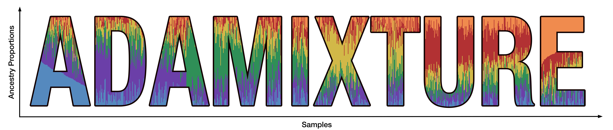

<p align="center">
  
</p>

<h3 align="center">
  Adaptive First-Order Optimization for Biobank-Scale Genetic Clustering
</h3>

<p align="center">
  
  
  
  
  
  <a href="https://doi.org/10.5281/zenodo.18289231"></a>
</p>

---

ADAMIXTURE is an unsupervised global ancestry inference method that scales the ADMIXTURE model to biobank-sized datasets. It combines the Expectation–Maximization (EM) framework with the Adam first-order optimizer, enabling parameter updates after a single EM step. This approach accelerates convergence while maintaining comparable or improved accuracy, substantially reducing runtime on large genotype datasets. For more information, we recommend reading [our preprint](https://www.biorxiv.org/content/10.64898/2026.02.13.700171).

The software can be invoked via CLI and has a similar interface to ADMIXTURE (_e.g._ the output format is completely interchangeable).

## System requirements

### Hardware requirements
The successful usage of this package requires a computer with enough RAM to be able to handle the large datasets the network has been designed to work with. Due to this, we recommend using compute clusters whenever available to avoid memory issues.

### Software requirements

We recommend creating a fresh Python 3.10+ virtual environment. For a faster installation experience, we highly recommend using [uv](https://github.com/astral-sh/uv) (or `pixi`). Alternatively, you can use `virtualenv` or `conda`.

As an example, using `uv` (recommended):
```console
$ uv venv --python 3.10
$ source .venv/bin/activate
$ uv pip install adamixture
```

Or using `virtualenv`:
```console
$ virtualenv --python=python3.10 ~/venv/nadmenv
$ source ~/venv/nadmenv/bin/activate
(nadmenv) $ pip install adamixture
```

> [!IMPORTANT]
> **macOS Users**: ADAMIXTURE requires OpenMP for parallel processing. You **must** install `libomp` (e.g., via Homebrew) before installing the package, otherwise the compilation will fail:
> ```console
> $ brew install libomp
> ```

## Installation Guide

The package can be easily installed in at most a few minutes using `pip` (make sure to add the `--upgrade` flag if updating the version):

```console
(nadmenv) $ pip install adamixture
```

## Running ADAMIXTURE

To train a model, simply invoke the following commands from the root directory of the project. For more info about all the arguments, please run `adamixture --help`. Note that **BED**, **VCF** and **PGEN** are supported:

> [!TIP]
> **GPU Acceleration**: Using GPUs greatly speeds up processing and is highly recommended for large datasets. You can specify the hardware to use with the `--device` parameter:
> - For NVIDIA GPUs, use `--device gpu` (requires CUDA).
> - For macOS users with Apple Silicon (M1/M2/M3/M4/M5), use `--device mps` to enable Metal Performance Shaders (MPS) acceleration. 
> - Note that biobank-scale datasets are best handled on dedicated CUDA-capable GPUs due to high RAM requirements. 

As an example, the following ADMIXTURE call

```console
$ ./admixture snps_data.bed 8 -s 42
```

would be equivalent in ADAMIXTURE by running

```console
$ adamixture -k 8 --data_path snps_data.bed --save_dir SAVE_PATH --name snps_data -s 42
```

Two files will be output to the `SAVE_PATH` directory (the `name` parameter will be used to create the full filenames):

- A `.P` file, similar to ADMIXTURE.
- A `.Q` file, similar to ADMIXTURE.

Logs are printed to the `stdout` channel by default. If you want to save them to a file, you can use the command `tee` along with a pipe:

```console
$ adamixture -k 8 ... | tee run.log
```

### Running with multi-threading

To run ADAMIXTURE using multiple CPU threads, use the `-t` flag:

```console
$ adamixture -k 8 --data_path data.bed --save_dir out/ --name test -t 8
```

### Running with GPU acceleration

To leverage GPU acceleration (highly recommended for large datasets), use the `--device` flag:

- **NVIDIA GPU (CUDA)**:
  ```console
  $ adamixture -k 8 --data_path data.bed --save_dir out/ --name test --device gpu
  ```
- **macOS Apple Silicon (MPS)**:
  ```console
  $ adamixture -k 8 --data_path data.bed --save_dir out/ --name test --device mps
  ```

> [!NOTE]  
> Biobank-scale datasets are best handled on dedicated CUDA-capable GPUs.

> [!TIP]
> **Biobank-Scale Execution & High K Values**: For large-scale datasets (e.g., UK Biobank, All of Us) with high K values, we recommend the following parameter settings for optimal convergence and performance:
> ```console
> --patience_adam 5 \
> --lr_decay 0.85 \
> --lr 0.0075
> ```

## Multi-K Sweep

Instead of running ADAMIXTURE for a single K, you can automatically sweep over a range of K values using `--min_k` and `--max_k`. The data is loaded once, and each K is trained sequentially:

```console
$ adamixture --min_k 2 --max_k 10 --data_path snps_data.bed --save_dir SAVE_PATH --name snps_sweep
```
## Other options

- `--lr` (float, default: `0.005`):  
  Learning rate used by the Adam optimizer in the EM updates.

- `--min_lr` (float, default: `1e-6`):  
  Minimum learning rate used by the Adam optimizer in the EM updates.

- `--lr_decay` (float, default: `0.5`):  
  Learning rate decay factor.

- `--beta1` (float, default: `0.80`):  
  Exponential decay rate for the first moment estimates in Adam.

- `--beta2` (float, default: `0.88`):  
  Exponential decay rate for the second moment estimates in Adam.

- `--reg_adam` (float, default: `1e-8`):  
  Numerical stability constant (epsilon) for the Adam optimizer.

- `--patience_adam` (int, default: `2`):  
  Patience for reducing the learning rate in Adam-EM.

- `--tol_adam` (float, default: `0.1`):  
  Tolerance for stopping the Adam-EM algorithm.

- `--data_path` (str, required):  
  Path to the genotype data (BED, VCF or PGEN).

- `--save_dir` (str, required):  
  Directory where the output files will be saved.

- `--name` (str, required):  
  Experiment/model name used as prefix for output files.

- `--device` (str, default: `cpu`):  
  Target hardware for computation. Choices: `cpu`, `gpu` (NVIDIA/CUDA), or `mps` (Apple Metal).

- `-s` (int, default: `42`):  
  Random number generator seed for reproducibility.

- `-k` (int):  
  Number of ancestral populations (clusters) to infer. Required if `--min_k`/`--max_k` are not specified.

- `--min_k` (int):  
  Minimum K for a multi-K sweep (inclusive). Must be used together with `--max_k`.

- `--max_k` (int):  
  Maximum K for a multi-K sweep (inclusive). Must be used together with `--min_k`.


- `--no_freqs` (flag):  
  If set, the P (allele frequencies) matrix is not saved to disk. Only the Q (admixture proportions) file will be written.

- `--max_iter` (int, default: `1500`):  
  Maximum number of Adam-EM iterations.

- `--check` (int, default: `5`):  
  Frequency (in iterations) at which the log-likelihood is evaluated.

- `--max_als` (int, default: `1000`):  
  Maximum number of iterations for the ALS solver.

- `--tol_als` (float, default: `1e-4`):  
  Convergence tolerance for the ALS optimization.

- `--power` (int, default: `5`):  
  Number of power iterations used in randomized SVD.

- `--tol_svd` (float, default: `1e-1`):  
  Convergence tolerance for the SVD approximation.

- `--chunk_size` (int, default: `4096`):  
  Number of SNPs in chunk operations for SVD.

- `-t` (int, default: `1`):  
  Number of CPU threads used during execution.


## License

This project is licensed under the BSD 3-Clause License - see the [LICENSE](LICENSE) file for details.

## Troubleshooting

### CUDA issues
If you get an error similar to the following when using the GPU:

`OSError: CUDA_HOME environment variable is not set. Please set it to your CUDA install root.`

Simply installing `nvcc` using conda or mamba should fix it:

```console
$ conda install -c nvidia nvcc
```

### macOS compilation issues
If you get errors related to OpenMP (OMP) during installation on macOS, ensure you have `libomp` installed via Homebrew:

```console
$ brew install libomp
```

## Cite

When using this software, please cite the following preprint:

```bibtex
@article{saurina2026adamixture,
  title={ADAMIXTURE: Adaptive First-Order Optimization for Biobank-Scale Genetic Clustering},
  author={Saurina-i-Ricos, Joan and Mas Monserrat, Daniel and Ioannidis, Alexander G.},
  journal={bioRxiv},
  year={2026},
  doi={10.64898/2026.02.13.700171},
  url={https://doi.org/10.64898/2026.02.13.700171}
}
