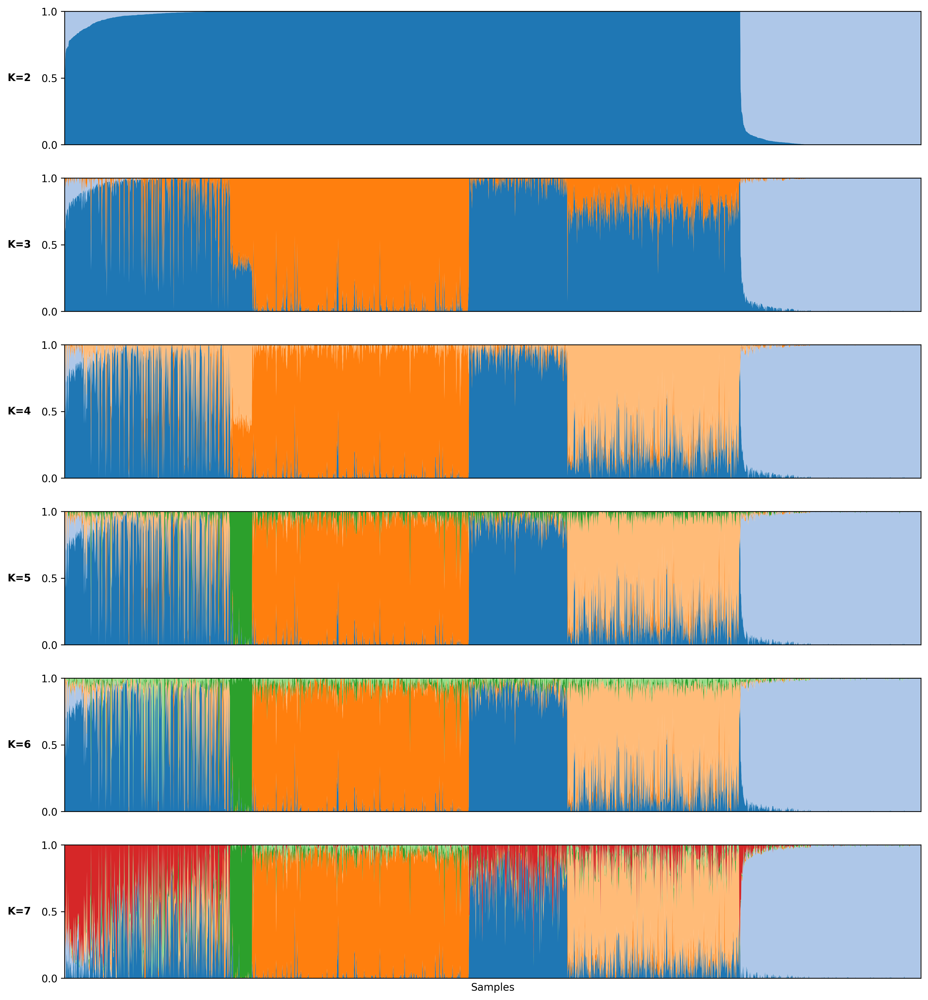
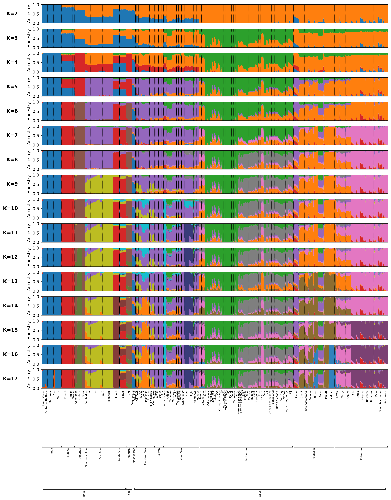

# Plotting

ADAMIXTURE includes native support for generating high-quality visualizations of ancestry proportions. Powered by [**Clumppling**](https://github.com/PopGenClustering/Clumppling), it automatically aligns clusters across runs and K values using Integer Linear Programming (ILP) optimization and mode detection, ensuring that same-colored bars represent the same ancestral components across different subplots.

## Single-run Plotting

To generate a plot automatically after training, use the `--plot` flag:

```console
$ adamixture -k 8 --data_path data.bed --save_dir out/ --name test --plot pdf 300
```

Arguments for `--plot` are optional:
- **Format** (e.g., `pdf`, `png`, `jpg`). Default: `png`.
- **Resolution** (DPI, e.g., `300`). Default: `300`.

### Population label flags

The following flags are available for both `adamixture --plot` and `adamixture-plot`:

- **Population Labels (Level 1)**: Use `--labels` to provide a file with one population name per sample. Samples will be grouped by population and sorted by ancestry within each group.
- **Hierarchical Grouping (Level 2)**: Use `--labels2` to provide a file with one coarser group label per sample (e.g., super-population or region). A bracket annotation tier is drawn under the level-1 tick marks.
- **Hierarchical Grouping (Level 3)**: Use `--labels3` to provide a file with one even coarser label per sample (e.g., continent). A second bracket annotation tier is drawn below the level-2 tier.
- **Custom Colors**: Use `--colors` to provide a file with hex or named colors (one per line). See [Custom Colors File Format](#custom-colors-file-format) below for details.

All three label files must have the same number of lines as there are samples. Levels 2 and 3 are only shown if the corresponding file is provided.

## Sweeps and Multi-K Plotting (`--min_k` and `--max_k`)

When training across a sweep of $K$ values using `--min_k` and `--max_k`, you can choose between two plotting modes:

- **Combined single plot (`--plot`)**:
  Generates a **single combined multi-panel plot** containing all $K$ subplots stacked vertically (similar to `adamixture-plot`), fully aligned for easy visualization of ancestry shifts. The resulting file will be named `name.minK_maxK.png`. This is the default behavior.
  ```console
  $ adamixture --min_k 5 --max_k 8 --data_path data.bed --save_dir out/ --name test --plot png 300
  ```

  Here is an example of a combined sweep plot (`--plot`) aligning $K=2$ to $K=7$:

  

- **Individual plots per K (`--plot_single`)**:
  Generates a separate plot file for each $K$ in the sweep (e.g., `name.K.png`), sequentially aligned so that ancestral components keep consistent colors from $K=i$ to $K=i+1$.
  ```console
  $ adamixture --min_k 5 --max_k 8 --data_path data.bed --save_dir out/ --name test --plot_single png 300
  ```

## Plot After Training (`adamixture-plot`)

For comparing multiple runs or different $K$ values using existing results, use the `adamixture-plot` command.

> [!NOTE]
> This command is a standalone post-processing tool. It **does not retrain** the models; it automatically aligns existing `.Q` matrices provided in a **filemap** using **Clumppling**'s Integer Linear Programming (ILP) optimization for color consistency across runs.

### Standard Multi-Run Plot (Default)

By default, `adamixture-plot` generates a multi-panel **stacked bar chart** with all runs aligned:

```console
$ adamixture-plot \
    --filemap project.filemap \
    --labels populations.txt \
    --labels2 regions.txt \
    --labels3 continents.txt \
    --colors my_palette.txt \
    --save_dir . \
    --name comparison \
    --format png
```

The `--labels`, `--labels2`, and `--labels3` flags accept files with **one label per line, one line per sample**, matching the order of samples in the Q matrices:
- **`--labels`** (level 1): Finest grouping. Used to draw vertical boundaries and x-axis tick marks between populations.
- **`--labels2`** (level 2): Intermediate grouping (e.g., super-population). Drawn as a bracket annotation tier below the tick marks.
- **`--labels3`** (level 3): Coarsest grouping (e.g., continent). Drawn as a second bracket tier below level 2.

Here is an example of a multi-level plot of Oceania populations generated after training:



### Clumppling Mode Graph (`--clumppling`)

> [!NOTE]
> The **`--clumppling`** mode graph visualization and alignment features are available for Python versions up to **3.13** (`python_version < 3.14`).

```console
$ adamixture-plot \
    --filemap project.filemap \
    --clumppling \
    --labels populations.txt \
    --format png
```

When **`--clumppling`** is enabled, you can fine-tune mode detection using the following parameters:

| Argument &nbsp;&nbsp;&nbsp;&nbsp;&nbsp;&nbsp;&nbsp;&nbsp;&nbsp;&nbsp;&nbsp;&nbsp;&nbsp;&nbsp; | Description |
|---|---|
| `--comm_min` | Minimum cost threshold for grouping runs into a single consensus mode (default: `1e-4`). |
| `--comm_max` | Maximum cost threshold above which runs are separated into distinct modes (default: `1e-2`). |
| `--cd_res` | Resolution parameter for Louvain community detection (default: `1.0`). Higher values ($\ge 1.5$) increase sensitivity to detect variant sub-modes. |
| `--cd_method` | Community detection method (`louvain`, `leiden`, or `custom`, default: `louvain`). |
| `--no_test_comm` | Skip the statistical significance test for community structure, forcing direct community partitioning of replicates. |

The `--clumppling` mode outputs a combined publication-ready figure containing:
1. **Mode Alignment Tree**: Top diagram displaying cluster divergence and mapping across $K$ values.
2. **Membership Alignment Graph**: Bottom diagram showing aligned ancestry proportions for each mode along with inter-mode cost values.

<p align="center">
  
  
</p>

### Filemap Format

A filemap is a three-column, tab-delimited file. Each line describes a single Q matrix:
1. **Unique ID**: Must contain at least one letter and cannot contain `#` or `.`.
2. **K Value**: The number of clusters.
3. **Path**: Path to the `.Q` file (relative to the filemap's directory).

Example `project.filemap`:
```text
RunA_K3    3    results/run1.Q
RunB_K5    5    results/run2.Q
RunC_K5    5    results/run3.Q
```

### Custom Colors File Format

The custom colors file supplied to `--colors` is a simple text file containing one color code per line. Color codes can be specified as:
- **HEX codes**: e.g., `#FF5733`
- **Standard CSS color names**: e.g., `crimson`, `royalblue`, `forestgreen`

The file must contain **at least as many colors as the highest $K$ value** in your run or sweep.

**Example `colors.txt`:**
```text
#1f77b4
#ff7f0e
#2ca02c
#d62728
#9467bd
#8c564b
#e377c2
#7f7f7f
```
